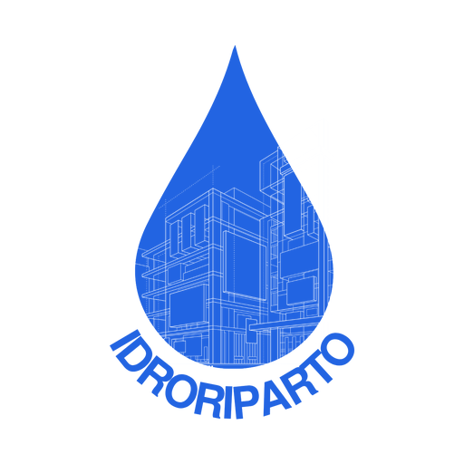

<div align="center">
 
 <h1>IdroRiparto</h1>

App per la **ripartizione dei consumi e delle spese dell’acqua condominiale**.

Pensata per amministratori, consiglieri e condomini che vogliono un prospetto chiaro, ripetibile e pronto per l’assemblea. I dati restano sul dispositivo: niente account, niente cloud.

 <p align="center">
  <a href="https://github.com/idroriparto/app">
   
   
   
  </a>
 </p>

</div>

## Cosa fa

- Anagrafica del condominio e delle **unità immobiliari** (millesimi, occupanti, sfitto, sottocontatore).
- **Campagne di lettura** del contatore generale e dei sottocontatori.
- Registrazione della **bolletta** del gestore, voce per voce:
  - quota fissa / canone
  - acquedotto
  - fognatura
  - depurazione
  - IVA e altre voci
- Quattro criteri di riparto, confrontabili sulla stessa bolletta:
  1. **Millesimi**: criterio residuale dell’art. 1123 c.c.
  2. **Consumo**: in proporzione ai m³ dei sottocontatori
  3. **Occupanti**: se deliberato in assemblea
  4. **Misto**: quote fisse da un lato, consumi a m³ dall’altro, **parti comuni e perdite** spalmate a parte
  5. **Consumo + differenza in millesimi della Tabella B**: in proporzione ai m³ dei sottocontatori; la differenza tra consumo effettivo e fatturato ripartito in base ai millesimi della Tabella B (Scale) 
- Avvisi automatici: millesimi ≠ 1.000, letture mancanti, perdite elevate, unità sfitte.
- **Prospetto PDF** (tabella + tagliandi individuali) e **CSV** per Excel.
- Tema chiaro / scuro e backup JSON.
- Breve **presentazione guidata** al primo avvio, rivedibile dalle impostazioni.
- Verifica automatica settimanale delle release ufficiali GitHub, disattivabile nelle impostazioni.

IdroRiparto è uno strumento di calcolo, non un parere legale.

## Avvio

Requisiti: Flutter 3.47+

```bash
cd idroriparto
flutter pub get
flutter test
flutter run -d chrome          # oppure un emulatore / un telefono
flutter build apk              # Android
flutter build ios              # iOS (su macOS)
flutter build web              # cartella build/web
flutter build linux
```

Al primo avvio una presentazione breve illustra anagrafica, letture, bollette, riparto e PDF. Al termine puoi **creare il tuo condominio** oppure consultare l’esempio **Palazzo Solferino** (Milano, 8 unità, letture 2025–2026 e due bollette già ripartite).

## Aggiornamenti

Dopo la presentazione iniziale, IdroRiparto consulta al massimo una volta ogni sette giorni la [release più recente](https://github.com/idroriparto/idroriparto/releases/latest) del repository GitHub. Il controllo può essere disattivato in **Impostazioni → Aggiornamenti**; **Verifica ora** resta disponibile anche quando i controlli automatici sono spenti.

L'app non installa mai software in background: l'avviso apre, solo dopo conferma esplicita, l'APK ufficiale su Android oppure la pagina della release sulle altre piattaforme. Per pubblicare una release, la tag deve corrispondere alla versione SemVer di `pubspec.yaml` (ad esempio `version: 1.0.4+4` richiede la tag `v1.0.4`); il workflow CI lo verifica prima della build.

## Struttura

```
lib/
  main.dart
  theme/theme.dart
  models/models.dart
  data/store.dart            # persistenza locale (SharedPreferences)
  data/demo_data.dart
  services/riparto_engine.dart
  services/update_service.dart
  services/pdf_service.dart
  screens/                   # home, unità, letture, bollette, riparto, impostazioni
  widgets/
```

## Piattaforme

Android, iOS, Web, Linux (WIP Windows). La persistenza usa `shared_preferences` (LocalStorage sul web).
